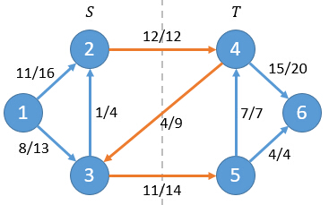

[TOC]

## 算法

### EK

#### 原理

$\text{BFS}$ 找增广路。

### Dinic

#### 原理

1. $\text{BFS}$ 构建残量网络分层图。
2. $\text{DFS}$ 寻找增广路。

#### 优化

1. 当前弧优化：在当前分层图中，对于一点记录当前遍历的出边，下次遍历到这点直接从记录的出边开始搜索。(前面的边均已无法增广)
2. 多路增广：$\text{DFS}$ 的过程中找到一条增广路后不是立即返回而是继续 $\text{DFS}$。

## 基本应用

### 最大流

略。

### 最 大/小 费用最大流

贪心地考虑，对于每一滴流量，最 大/小 化其沿途的边费用之和。

于是不难想到改造 $\text{EK}$ 算法，将 $\text{BFS}$ 改为 $\text{SPFA}$，不断找到当前残量网络的最 大/小 花费即 $s$ 到 $t$ 的最 长/短 路 (以单位费用为边权)，同时找到能够通过此路径增广的最多流量，增广即可。

正确性不难理解。

一个小技巧，求最大费用最大流可以将边权变相反数然后跑最小费用最大流，最后将所得答案再次取反即可。

## 最小割

### 定义

1. 割：对于一个网络流图 $G=(V,E)$，其割的定义为一种点的划分方式：将所有的点划分为 $S$ 和 $T=V-S$ 两个部分，其中源点 $s \in S$，汇点 $t \in T$。
2. 净流：对于一个割 $(S,T)$，定义净流 $f(S,T)$ 表示穿过割 $(S,T)$ 的**流量**之和。
3. 割的容量：$C(S,T)$ 为所有从 $S$ 到 $T$ 的边容量之和。
4. 最小割：割的容量最小的割。

### 理解

> 净流：$f = f(2,4)+f(3,4)+f(3,5) = 12+(-4)+11 = 19$
>
> 割的容量：$C = c(2,4)+c(3,5)=12+14=26$

### 推论

#### 对于任意一个割的净流 $f(S,T)$ 总是和网络流的流量 $f$ 相等。

证明：

该结论等价于 $f (S, T) = f (s, V)$
$$
f(S, T) = f(S, V) - f (S, S)\\
f(S, S) = 0 \Rightarrow f(S, T) = f (S, V)\\
f (S, T) = f (s, V) + f (S - s, V)\\
f (S - s, V) = 0 \Rightarrow f (S, T)  = f (s, V) = f
$$
证毕。

对于任意一个割的净流 $f(S,T)$ 一定小于等于割的容量 $C(S,T)$，结合上述推论即为，**网络的任意一个流 $f$ 一定不大于任意一个割的容量 $C(S,T)$**。

#### 最大流最小割定理

> 对于一个网络流图 $G=(V, E)$，其中有源点 $s$ 和汇点 $t$，那么下面三个条件是等价的：
>
> 1. 流 $f$ 是图 $G$ 的最大流。
> 2. 残量网络 $G'$ 不存在增广路。
> 3. $\exist C(S, T) = f$

证明：

$1 \Rightarrow 2$：

反证法，假设 $f$ 为最大流，但 $G'$ 中存在增广路，其流量为 $f'$。则 $f + f' > f$ 即 $f$ 非最大流，与假设矛盾。

$2 \Rightarrow 3$：

$G'$ 中不存在增广路即 $G'$ 中不存在路径从 $s$ 到 $t$。

构造性地定义集合 $S$ 为：$G'$ 中 $s$ 能到达点的集合，同时定义 $T = V - S$。

此时 $(S, T)$ 为一个割，且 $\forall u \in S, v \in T$ 有 $f (u, v) = c (u, v)$。使用反证法不难证明：若 $f (u, v) < c (u, v)$ 则 $s$ 能到达 $v$，与 $v \in T$ 矛盾。

因此有 $f = f (S, T) = \sum f (u, v) = \sum c (u, v) = C (S, T)$。

$3 \Rightarrow 1$：

由于 $\forall f, C (S, T):|f| \leq C (S, T)$。当 $f$ 等于一个割的容量时，说明其已达到上界，因此 $f$ 为最大流。同理与 $|f|$ 相等的割为最小割。

证毕。

综上可知：**最大流 = 最小割**。

### 最小割树

#### 性质：
1. 一颗包含原图所有点的树。
2. 树上两点简单路径上边权的最小值为原图中两点最小割。

#### 构建

递归增量构造，设当前点集为 $S$（初始为原图所有点），任取两点 $u, v$，在**原图**上跑出两点最小割 $mincut (u, v)$，并在最小割树上连边 $(u, v, mincut (u, v))$。将点集根据 $u, v$ 割集划分成 $X, Y$，递归处理两个点集。
复杂度 $O(n^3m)$。

#### 正确性

> 为书写方便，$\operatorname{def}: f \gets mincut$

$\text{lemma}$：对于原图任意三点 $a, b, c$，满足 $f (a, b) \geq \min \{f (a, c), f (c, b) \}$。

证明：

* 如果 $c \in S_a$，那么有 $f (c, b) \leq f (a, b)$。
* 如果 $c \in S_b$，那么有 $f (a, c) \leq f (a, b)$。

整理可知命题成立。

> 推论：对于原图任意两点 $u, v$ 和一个序列 $p_{1 \sim m}$，有 $f (u, v) \geq \min \{ f (u, p_1), f (p_1, p_2), f (p_2, p_3), \dots f (p_m, v) \}$。

将序列 $p$ 赋为最小割树 $u \to v$ 的路径，设 $x, y$ 为 $p$ 中 $f$ 最小的相邻两点。  
根据推论有 $f (u, v) \geq f (x, y)$。又因为 $u, v$ 分处 $x, y$ 两侧，即在 $x, y$ 最小割的不同点集，于是有 $f (u, v) \leq f (x, y)$。联立得 $f (u, v) = f (x, y)$。正确性得证。

## 最大权闭合子图

### 定义

一个有向图 $G = (V, E)$ 的闭合图是该有向图的一个点集，且该点集的所有出边都还指向该点集。即闭合图内的任意点的任意后继也一定在闭合图中。

### 构造

构造一个网络 $N$：

在原图点集基础上增加源 $s$ 和汇 $t$ ；将原图每条有向边 $<u, v> \in E$ 增加容量为 $\infty$ ；增加 $s$ 到每个正权点 $u$ 的边，容量为 $w_u$ ；增加每个负权点 $v$ 到 $t$ 的边，容量为 $-w_v$。

### 证明

定义：一个割 $(S, T)$ 中每一条边其中一个端点都是 $s$ 或 $t$，则称该割为**简单割**。

#### 引理

1. 在网络 $N$ 中，最小割为简单割。

	证明：较易，略。

2. 网络 $N$ 中简单割与 $G$ 中闭合图一一对应。

	证明：

	闭合图对应简单割：反证法。假设存在闭合图不对应简单割，则说明割中存在原图中的边即 $\exist <u, v>:u \in S, v \in T$。则 $u$ 后继 $v$ 不在闭合图中，矛盾。

	简单割对应闭合图：即证 $V = S - \left\{s \right\}$ 为闭合图。考察 $V$ 中任意一点 $u$ 的任意一条出边 $<u, v>$，根据简单割的性质可知 $v \in V$，符合闭合图定义。

	证毕。

3. 最小割对应最大权闭合子图。

	证明：

	对于割 $(S, T)$，$C(S, T)$ = $T$ 中所有正权点的权值之和 + $S$ 中所有负权点的权值绝对值之和。

	> 解释：考虑割的实际意义，$T$ 中存在正权点说明其与 $s$ 连边被割，同理 $S$ 中存在负权点说明其与 $t$ 连边被割。

	闭合子图的权值 $W$ = $S$ 中所有正权点的权值之和 - S中所有负权点的权值绝对值之和。

	联立得 $C(S, T) + W$ = $T$ 中所有正权点的权值之和 + $S$ 中所有正权点的权值之和 = 所有正权点的权值之和。

	所以 $W$ 等于所有正权点的权值之和 - $C(S,T)$。

	最小化 $C (S, T)$ 即最大化 $W$，因此最小割对应最大权闭合子图。

## 做题记录

[飞行员配对方案问题](https://loj.ac/p/6000)

> 二分图最大匹配 $\Rightarrow$ 最大流。
>
> 建立超级源 $s$ 、汇 $t$ 。
>
> $s$ 连所有正驾驶员，所有副驾驶员连 $t$，连上给定的正驾驶员到副驾驶员的边，以上所有边容量均为 $1$。
>
> 最大流即为答案。

[分配问题](https://loj.ac/p/6012)

> 最 大/小 权二分图最大匹配 $\Rightarrow$ 费用流
>
> 建模与上题出入不大，给二分图中的边额外一个权值的费用即可。

[方格取数](https://loj.ac/p/6007)

> 最小割。
>
> 首先可以将题目建成一个二分图，两边点集有连边的点对不能同时选，要求最大化选出的点集的权值和。
>
> 如何用网络流来刻画 "不能同时选" 这一约束条件呢？
>
> 不妨先选定所有点，然后考虑如何去除权值和最小的点集使得剩下的点满足条件。
>
> 可以这样建模：
>
> 新建超级源汇 $s$ 、$t$ 。
>
> $s$ 连所有二分图左侧点，容量为该点点权。二分图所有右侧点连 $t$，容量为点权。对于二分图中有连边的点，从左侧点连向右侧点，容量为 $\infty$ 。所有点权值之和 - 最小割即为答案。
>
> 分析此模型：
>
> 在该模型中，存在冲突点同时选的情况对应源汇点连通。割掉二分图中点之间的边是无意义的 (无法改变冲突关系)，只能割掉与 $s$ 或 $t$ 连通的边即割只能是简单割。割掉相应边的实际意义即为不选对应的点。割的容量为去掉相应点集的代价。因此，最小割就是保证合法的最小代价。

[试题库](https://loj.ac/p/6006)

> 题意有点模糊，每个试题最后只能定为一个类别。
>
> 最大流问题，建模如下：
>
> 

[最小路径覆盖](https://loj.ac/p/6002)

> 拆点+二分图最大匹配。
>
> 建模方法：
>
> 拆点，对于点 $i$ 拆为 $i_1, i_2$ ，$i_1$ 表示**出点**，$i_2$ 表示**入点**。
>
> 对于原图中的边 $<i, j>$ 连 $<i_1, j_2>$，再将 $s$ 与所有 $i_1$ 相连，所有 $i_2$ 与 $t$ 相连。
>
> 点数 $n$ - 最大匹配数即为答案。
>
> 原理：
>
> 考虑每一个匹配的实际意义，匹配 $i_1, j_2$ 相当于将以 $i_1$ 结尾的路径连上 $j_2$ 开头的路径。而匹配保证了每一个点出度最多为 $1$ 即不会有分叉，一定是路径。最大化匹配数量就等价于最小化度数为 $0$ 的 $i_2$ 点，即最小化路径数。

[魔术球问题](https://www.luogu.com.cn/problem/P2765)

> 拆点+最小路径覆盖
>
> 建模方法：
>
> 由于是从小到大依次放，考虑动态的过程，每次加入 $i$，连上 $i$ 与小于 $i$ 的合法边。如果成功增广说明 $i$ 能够直接放到原来的柱子上，否则就得新开一个柱子。当有 $n$ 个柱子且不能再放时就退出。

[航空路线问题](https://loj.ac/p/6122)

> 转化问题，一条从起点到终点再返回起点的哈密顿回路 $\Leftrightarrow$ 两条从起点到终点的不相交路径。
>
> 建模方法：
>
> 为保证路径不相交即每个点只经过一次，采用拆点的套路，对于点 $i$ 拆点为 $i_1$ 和 $i_2$，连边 $<i_1, i_2, 1>$ 保证 $i$ 最多被经过一次。对于起点和终点特殊处理，因为要经过两次。
>
> 原图中的边 $<i, j> (i < j)$ 在网络流图中连 $<i_2, j_1, \infty>$，再把起点与源点相连、终点与汇点相连即可。

[运输问题](https://loj.ac/p/6122)

> 较易，直接费用流即可，建模过程略。
>
> 此外，此题要求求出最 大/小 费用，沿用之前的套路，对于最大费用，直接将边权取反跑最小费用，最后再次将答案取反即可。

[深海机器人问题](https://www.luogu.com.cn/problem/P4012)

> 约束条件：每条边只能贡献一次，但可以多次经过。
>
> 建模很简单，对于原图中的边 $<i, j, v>$ ，在网络流图中连边 $<i, j, 1, v>$ 与 $<i, j, \infty, 0>$ 就完美解决了这个问题。

[火星探险问题](https://www.luogu.com.cn/problem/P3356)

> 与上题大体一致，不过上题中权值在边上，本题在点上。很简单，对点拆点即可，建模方法参考上题。
>
> 输出方案可以在建图时记录每条边的方向，$\text{DFS}$ 即可。

[骑士共存问题](https://loj.ac/p/6226)

> 约束条件：若干点对不能同时选。
>
> 发现原图是个二分图，即不能同时选的点对一定在两个不同点集中。
>
> 这种“不能同时选”的约束，自然想到了割。将 $s$ 和 $t$ 分别和两侧点集中所有点连边，容量均为 $1$，对于不能同时选的点 $i, j$ 连边 $<i, j, \infty>$。
>
> 建立好模型后发现约束条件满足表现为 $s, t$ 不连通，也就是一个割。最小割就是使要求满足需要去除的最少点数，总点数-最小割即为答案。

[最长 k 可重区间集](https://loj.ac/p/6014)

> 有趣的费用流问题。
>
> 两种**本质相同**建模方法：
>
> 
>
> 
>
> 下面进行解释。
>
> 两种方案本质相同：可根据物理中电路图知识判定。
>
> 建模意义：
>
> 1. 感性：
>
> 	$s$ 流量为 $k$ 是为了保证每个点最多被 $k$ 个区间覆盖即每个点最多被覆盖 $k$ 次。转化为找 $k$ 条增广路，每次增广选取一些区间并覆盖相应的点，保证每条增广路最多覆盖一个点一次，即每条增广路包含的区间**互不相交**。因此首先将所有区间并联，再将不相交的区间串联即可。
>
> 2. 理性：
>
> 	结论：$k$ 可重区间集 $S$ 能划分成 $k$ 个子集 $S_{1\dots k}$ 满足子集两两交集为空且并集为 $S$。且 $\forall x, y \in \forall S_i$ 有 $x, y$ 区间互不相交。
>
> 	证明：
>
> 	考虑动态地按右端点升序添加区间的过程，首先添加区间至已有 $k$ 个两两相交的区间，分别属于子集 $S_{1 \dots k}$ 。
>
> 	考虑新加一个区间 $[l, r]$，由于右端点有序，所以只需考虑证明**存在** $i$ 满足 $S_i$ 中右端点最大的区间 $[l_i, r_i]$ 满足 $r_i \leq l$。
>
> 	由于 $S$ 为 $k$ 可重区间集，若 $l < (r_i)_{\min}$ 则说明存在一点被覆盖 $k + 1$ 次，不合法。因此存在 $r_i \leq l$，把 $[l, r]$ 区间放到 $S_i$ 中即可。
>
> 	证毕。

## 套路笔记

### 边权

给边添上边权费用。

### 点权

拆点 $i$ 为 $i_1, i_2$，连边 $<i_1, i_2>$，在添上点权为费用。

### 边只能经过一次

将边容量设为 $1$。

### 点只能经过一次

拆点 $i$ 后将 $<i_1, i_2>$ 容量设为 $1$。

### 动态添边增广

用于没有给出边界的题目 (边界需自己求得，如不能再加...)，例如：[魔术球问题](https://www.luogu.com.cn/problem/P2765)

动态添边，如果找到了增广路说明新加的边一定有流从而确认操作合法之类的东西。

### 不能同时选

将“同时选”表现为源汇点连通从而利用最小割模型。

很多情况是建模成二分图，只有两侧点集之间存在冲突，对冲突点连边容量设为 $\infty$ 保证割有意义，只能是简单割。与源汇点相连的边的容量一般为边权。

### 输出方案

根据反向边容量不为 $0$ 判断正向边有流。

输出路径的可以记录每个点的前驱 $\text {pre}$。然后编写函数根据要求 正/倒序 输出。

如果要输出方向 (如网格图路径），可以连边的时候记录一下每条边的方向，省去大量判断。

如果要输出多条路径，可以采用 $\text{DFS}$ 的办法，每次 $\text{DFS}$ 搜出一条路径后顺便将路径上所有边的反向边流量减一（意为删掉一条已经遍历的路径），从而防止重复搜索路径。

输出最小割需要从 $s$ 开始遍历找到包含 $s$ 在内的最大连通块，连通块边界上的满流边即为割中边。