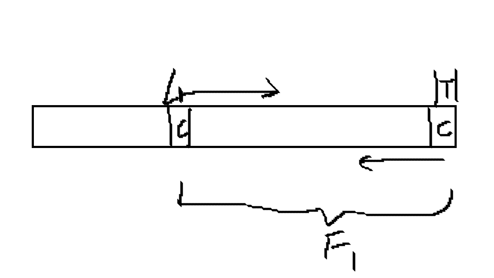
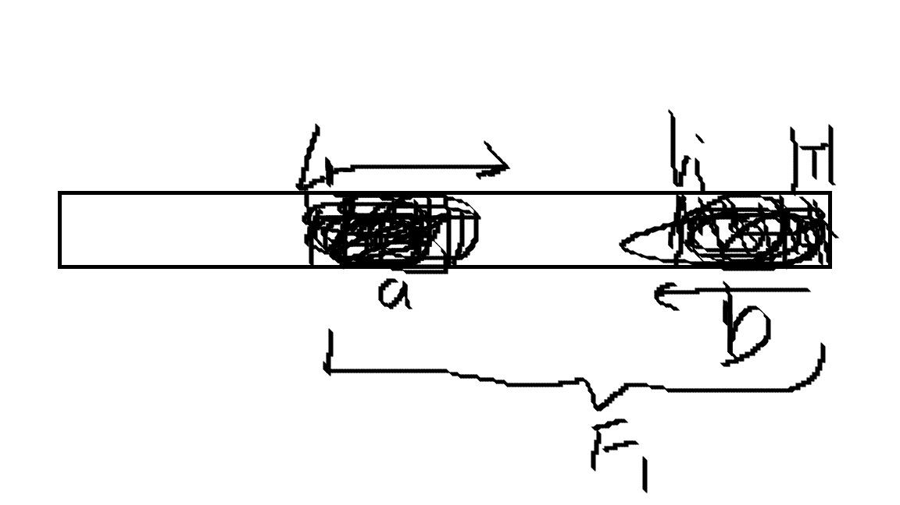

# 回文自动机 $\text{PAM}$

## 前置 性质/定理

1. 对于一个字符串 $S$，其本质不同回文子串个数最多有 $|S|$ 个。

   证明：

   数学归纳法。

   当 $|S| = 1$ 时，显然成立。

   当 $|S| > 1$ 时，假设其成立。考虑 $|S| + 1$ 情况，设 $T=Sc$ 表示 $S$ 与字符 $c$ 拼接得到的新字符串。此时新增的回文子串必是 $T$ 的后缀。取出其中的最长回文后缀 $F_1$，设其左端点为 $l_1$，有下图中性质：

   

   即从 $l_1$ 向右读的串与从 $|T|$ 向左读的等长串必然相等。

   对于一个更小的回文后缀 $F_i$ 及其左端点 $l_i$，有下图性质：

   

   图中 $F_i = b$，且 $b$ 等于 $a$ 的反串 (上面最近的性质)。由于 $F_i$ 为回文串，则 $b$ 的反串等于 $b$ 等于 $a$ 反串，即 $a = b = F_i$。由于 $a$ 的右端点小于 $|T|$，因此 $F_i$ 已出现过。

   综上，每次新加字符时最多新增一个回文子串，且长度最长。即本质不同的回文子串最多 $|S|$ 个，证毕。

## 构造原理

务必保证任意一条 $\text{fail}$ 链先经过偶根最后结束于奇根。