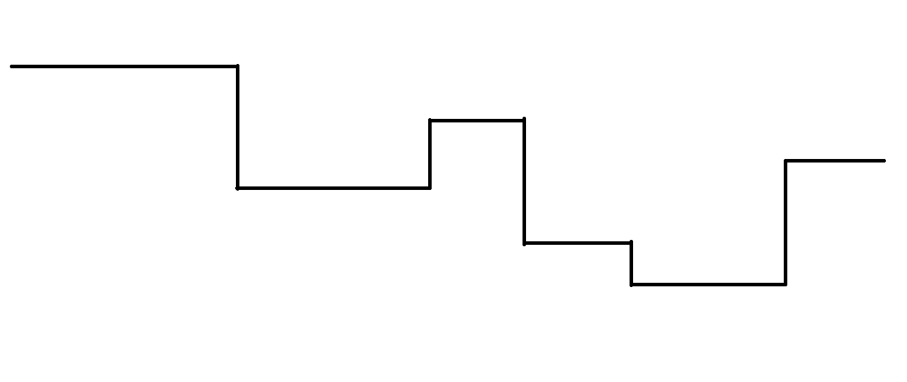

## 题意

给一个由正整数组成的长为 $n$ 的序列 $a$，和一个由 A或B 组成的长为 $m$ 的操作序列。

从左到右依次遍历操作序列中的元素：

若当前元素为 A，$a$ 序列进行如下操作：

```cpp
for (int i=2; i<=n; ++i) if (a[i] < a[i-1]) a[i]+=1;
```

若当且元素为 B，$a$ 序列进行如下操作：

```cpp
for (int i=n-1; i>=1; --i) if (a[i] < a[i+1]) a[i]+=1;
```

求遍历完操作序列后 $a$ 序列的情况。

> $n, m \leq 3 \times 10^5$

---
</br>

## 分析

首先可以把连续的相同元素缩成一个，因为他们至始至终都相同。同理，遍历操作序列的过程中也可以不断合并相同的相邻元素，最多合并 $n-1$ 次。  

问题转化为快速找到并合并需要合并的位置。



如上图，水平线段是连续的一段相同元素。进行一次操作后若干水平线段会上升一个单位，如果相邻的两个水平线段一个上升一个不变，那么两个水平段所夹的竖直线段长度就会缩短一个单位（否则不变，不可能变长）。当一个竖直线段缩短为 $0$ 时两个水平线段就会合并。  
对每一个水平线段维护：

* $h_0, t_0$，表示在 $t_0$ 时刻时该水平线段高度为 $h_0$
* $f_A, f_B$，表示遇到操作 A 和 B 时该水平线段能否上升
* $pre, nxt$，记录左右相邻的段编号，为了支持快速合并（等价于删除两个然后新增一个）

每个竖直线段的信息就能由相邻的水平线段信息组合得到。竖直线段可以大致分类：

1. 不缩短
2. 遇到操作 A 会缩短
3. 遇到操作 B 会缩短
4. 遇到操作 AB 都会缩短

但每个竖直线段所处的类别是会变化的，因为操作会影响水平线段的高度，可能改变原有的 $f_A, f_B$，进而改变竖直线段的类别。  

可以按缩短为 $0$ 的时刻依次处理每个竖直线段，尝试合并两个水平线段时判断一下是否合法（高度相等），然后需要更新两个竖直线段，但其实也没必要，因为错误的信息不会影响正确性，一视同仁地做，直接插入两个新的竖直线段即可。用双向链表维护合并操作。

复杂度 $O(n+m)$

## 代码实现

```cpp
#include <cstdio>
#include <iostream>
#include <vector>
#include <algorithm>

using std::cin;
using std::cout;

const int N = 3e5;

int n;
int H[N + 5];

int m;
char Str[N + 5];

int sn;
struct Seg {
  int l, r, h0, t0, st, pre, nxt;
}S[N * 2 + 5];

int Cnt[N + 5][4];
std::vector <int> V[N + 5][4];

int nwt; // time now
int Fa[N * 2 + 5]; // DSU

void Init();
void Updst (int);
void Updve (int); // 处理竖直段
int Hei (int);
void Merge (int);
int Find (int);

int main() {
  std::ios::sync_with_stdio (0);

  cin >> n >> m;
  for (int i = 1; i <= n; ++i) cin >> H[i];
  cin >> (Str + 1);
  
  Init();
  for (nwt = 1; nwt <= m; ++nwt) {
    Cnt[nwt][1] = Cnt[nwt - 1][1] + (Str[nwt] == 'A');
    Cnt[nwt][2] = Cnt[nwt - 1][2] + (Str[nwt] == 'B');
    Cnt[nwt][3] = Cnt[nwt - 1][3] + 1;
    
    for (int i = 1; i <= 3; ++i)
      for (int j : V[Cnt[nwt][i]][i]) Merge (j);
  int tt=0;
  }nwt = m;
  for (int i = Find (1); i; i = S[i].nxt)
    for (int j = S[i].l; j <= S[i].r; ++j) cout << Hei (i) << ' ';
  return cout << '\n', 0;

}void Merge (int p) {
  p = Find (p);
  int q = S[p].nxt;
  if (p == 0 || q == 0) return;
  if (Hei (p) != Hei (q)) return;

  int u = ++sn;
  Fa[p] = Fa[Find (q)] = u;
  S[u] = (Seg) {S[p].l, S[q].r, Hei (p), nwt, 0, S[p].pre, S[q].nxt};
  if (S[p].pre) S[S[p].pre].nxt = u;
  if (S[q].nxt) S[S[q].nxt].pre = u;
  
  Updst (u);
  if (S[u].pre) Updve (S[u].pre);
  if (S[u].nxt) Updve (u);

}void Init() {
  for (int i = 1; i <= n; ++i)
    if (H[i] == S[sn].h0) S[sn].r = i;
    else {
      if (sn) S[sn].nxt = sn + 1;
      ++sn, S[sn] = (Seg) {i, i, H[i], 0, 0, sn - 1, 0};
    }
  
  for (int i = 1; i <= sn; ++i) Updst (i);
  for (int i = 1; i < sn; ++i) Updve (i);

}void Updst (int p) {
  int q = S[p].pre;
  if (q) S[p].st ^= (Hei (p) < Hei(q));
  q = S[p].nxt;
  if (q) S[p].st ^= ((Hei (p) < Hei(q)) << 1);

}void Updve (int p) {
  int dh = std::abs (Hei (p) - Hei (S[p].nxt)); 
  int st = (S[p].st ^ S[S[p].nxt].st), c = Cnt[nwt][st];
  if (st && dh && c + dh <= m) V[c + dh][st].emplace_back (p); 

}int Hei (int p) {
  return S[p].h0 + Cnt[nwt][S[p].st] - Cnt[S[p].t0][S[p].st];

}int Find (int p) {
  return (Fa[p] ? (Fa[p] = Find (Fa[p])) : p);
}
```